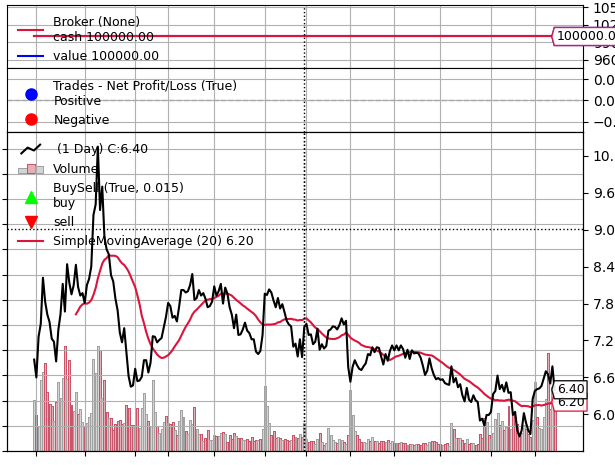

# transcation

```
order.executed.price,价格
order.executed.value,花费
order.executed.comm，佣金
```


```
毛利润，净利润，净利润=毛利润 - 营运成本
trade.pnl, trade.pnlcomm

```

current close less than previous close当前收盘少于先前收盘

# 配置文档，和思考

backtrader插件文档位置，和参考示例

https://www.backtrader.com/docu/quickstart/quickstart/#do-not-only-buy-but-sell

```
len(self) >= (self.bar_executed + 5):
```

**报错**

```
E:\code\chanlun\venv\Scripts\python.exe C:/Users/47361/Desktop/量化代码/test.py
Traceback (most recent call last):
  File "C:\Users\47361\Desktop\量化代码\test.py", line 17, in <module>
    get_data()
  File "C:\Users\47361\Desktop\量化代码\test.py", line 10, in get_data
    df = ts.get_k_data(code, autype='qfq', ktype="30",start=start, end=end)
         ^^^^^^^^^^^^^^^^^^^^^^^^^^^^^^^^^^^^^^^^^^^^^^^^^^^^^^^^^^^^^^^^^^
  File "C:\Users\47361\AppData\Local\Programs\Python\Python311\Lib\site-packages\tushare\stock\trading.py", line 706, in get_k_data
    data = data.append(_get_k_data(url, dataflag, 
           ^^^^^^^^^^^
  File "E:\code\chanlun\venv\Lib\site-packages\pandas\core\generic.py", line 6204, in __getattr__
    return object.__getattribute__(self, name)
           ^^^^^^^^^^^^^^^^^^^^^^^^^^^^^^^^^^^
AttributeError: 'DataFrame' object has no attribute 'append'. Did you mean: '_append'?
本接口即将停止更新，请尽快使用Pro版接口：https://tushare.pro/document/2
```

解决方法：降低pandans版本解决，原来为2.1版，降低到1.5版本

使用jupyter notebook  进入


时间范围

```
  dataname=data,
                                fromdate=datetime.datetime(2022, 10, 28),
                                todate=datetime.datetime(2023, 10, 20)
```

这个函数是调用图形的

```
cerebro.plot()
```



SimpleMovingAverage 作用是获取平均移动线


```
data = bt.feeds.YahooFinanceCSVData(
    dataname=datapath,
    # Do not pass values before this date
    fromdate=datetime.datetime(2022, 10, 28),
    # Do not pass values before this date
    todate=datetime.datetime(2023, 10, 20),
    # Do not pass values after this date
    reverse=False)
```

```
datapath = os.path.join(os.path.join(os.getcwd(),"数据地址"),"002388.csv")
```

中文知识介绍

https://zhuanlan.zhihu.com/p/148064233