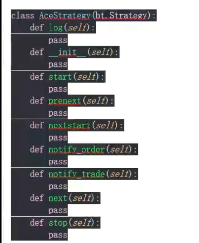

# transcation

```
order.executed.price,价格
order.executed.value,花费
order.executed.comm，佣金
```


```
毛利润，净利润，净利润=毛利润 - 营运成本
trade.pnl, trade.pnlcomm

```

current close less than previous close当前收盘少于先前收盘

# 配置文档，和思考

backtrader插件文档位置，和参考示例

https://www.backtrader.com/docu/quickstart/quickstart/#do-not-only-buy-but-sell

```
len(self) >= (self.bar_executed + 5):
```

**报错**

```
E:\code\chanlun\venv\Scripts\python.exe C:/Users/47361/Desktop/量化代码/test.py
Traceback (most recent call last):
  File "C:\Users\47361\Desktop\量化代码\test.py", line 17, in <module>
    get_data()
  File "C:\Users\47361\Desktop\量化代码\test.py", line 10, in get_data
    df = ts.get_k_data(code, autype='qfq', ktype="30",start=start, end=end)
         ^^^^^^^^^^^^^^^^^^^^^^^^^^^^^^^^^^^^^^^^^^^^^^^^^^^^^^^^^^^^^^^^^^
  File "C:\Users\47361\AppData\Local\Programs\Python\Python311\Lib\site-packages\tushare\stock\trading.py", line 706, in get_k_data
    data = data.append(_get_k_data(url, dataflag, 
           ^^^^^^^^^^^
  File "E:\code\chanlun\venv\Lib\site-packages\pandas\core\generic.py", line 6204, in __getattr__
    return object.__getattribute__(self, name)
           ^^^^^^^^^^^^^^^^^^^^^^^^^^^^^^^^^^^
AttributeError: 'DataFrame' object has no attribute 'append'. Did you mean: '_append'?
本接口即将停止更新，请尽快使用Pro版接口：https://tushare.pro/document/2
```

解决方法：降低pandans版本解决，原来为2.1版，降低到1.5版本

使用jupyter notebook  进入


时间范围

```
  dataname=data,
                                fromdate=datetime.datetime(2022, 10, 28),
                                todate=datetime.datetime(2023, 10, 20)
```

这个函数是调用图形的

```
cerebro.plot()
```


SimpleMovingAverage 作用是获取平均移动线


```
data = bt.feeds.YahooFinanceCSVData(
    dataname=datapath,
    # Do not pass values before this date
    fromdate=datetime.datetime(2022, 10, 28),
    # Do not pass values before this date
    todate=datetime.datetime(2023, 10, 20),
    # Do not pass values after this date
    reverse=False)
```

```
datapath = os.path.join(os.path.join(os.getcwd(),"数据地址"),"002388.csv")
```

中文知识介绍

https://zhuanlan.zhihu.com/p/148064233


五日均线

十日均线什么意思


```
利用广播功能创建20日均线
data["ma_20"] = data["ma_10"] + 1000
```

这样就会多一列，之后保存数据文件，index=False的作用就是删除索引

```
data.to_csv(r"地址",index=False)
```


为了拓展数据可以新写一个类，继承bt.fewds.PandasData

("ma_5",6)，在csv数据中第六列，需要使用元组

```
class AcePandsDate(bt.fewds.PandasData)
  lines = ("ma_5","ma_10","ma_20")
  params = (
    ("ma_5",6),
    ("ma_10",7),
    ("ma_20",8)
  )
```

在next中打印日志

```
        print(f"日期：{self.data0.datetime.date(0)},   5日线:{self.data0.ma_5[0]}   ,  10日线:{self.data0.ma_10[0]} ,  20日线:{self.data0.ma_20[0]} ")

```


能在外部计算的数值，最好在外部计算


## 策略模块

4，创建策略_看顺序_

需要操作的条件在next中构造



五日均线一定至少要有5跟k线，从第五根开始才能形成ma_5

在均线形成前，调用prenest()

指标模块

```
    params = (
        ('maperiod',20),
    )
    参数设置为20
bt.indicators指标模块
生成五日线，是流，类似lst = [*rang(10)],在next()中使用的是数据流中的一个点lst[-2]
        self.sma_5 = bt.indicators.SimpleMovingAverage(
            self.data0.close, period=self.params.maperiod)
```

在next中

前一天的ma_5[-1],今天ma_5[0]

创建ace这个类，继承于bt.Strategy的

```
class AceStrategy(bt.Strategy):
```

需要操作的条件在next函数中构造

```
class AceStrategy(bt.Strategy):
    params = (
        ('maperiod',20),
    )

    def log(self):
        pass


    def __init__(self):
        print(f'init___{self.datas[0].datetime.date(0)}')
        # self.dataclose = self.datas[0].close
        self.sma_5 = bt.indicators.SimpleMovingAverage(
            self.data0.close, period=self.params.maperiod)


    def start(self):
        print(f"start!___{self.datas[0].datetime.date(0)}")

    def prenext(self):
        print(f"prenext___{self.datas[0].datetime.date(0)}")

    def nextstart(self):
        print(f'nextstart___{self.datas[0].datetime.date(0)}')
订单状态
    def notify_order(self):
        pass
交易状态，盈利牟利率
    def notify_trade(self):
        pass


    def next(self):
        print(f'next___{self.datas[0].datetime.date(0)}, ma_5:{round(self.sma_5[0],2)}, 前一天MA_5:{round(self.sma_5[-1],2)}')

    def stop(self):
        print(f"stop___{self.datas[0].datetime.date(0)}")
```


### 4.第一个简单策略

设置规则，三日线上穿5日线买入，3日线下穿5日线卖出

```
SimpleMovingAverage 简单移动平均
if not self.position:有无持仓
```


想要消除这个，在init中加上

```
        self.买入条件.plotinfo.plot = False
        self.卖出条件.plotinfo.plot = False
```


### 5.第一个指标

五日突破就买入，跌破就卖出


### 6.双周期

30分钟突破上轨买入，30分钟突破下轨卖出

需要下载30分钟数据和日线数据


30分钟数据下载方式

使用分钟为30分钟

```
timeframe = bt.TimeFrame.Minutes,                                compression = 30
```

把30分钟线变为日线

```
cerebro.resampledata(三十分钟线,timeframe = bt.TimeFrame.Days)   #self.data1

```

一定要加上括号，变成函数方法

```
        self.上下轨 = self.上下轨()
```

